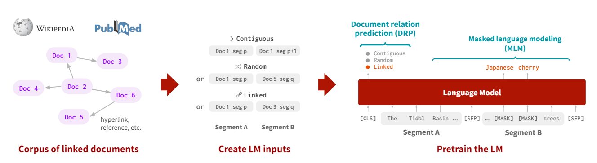
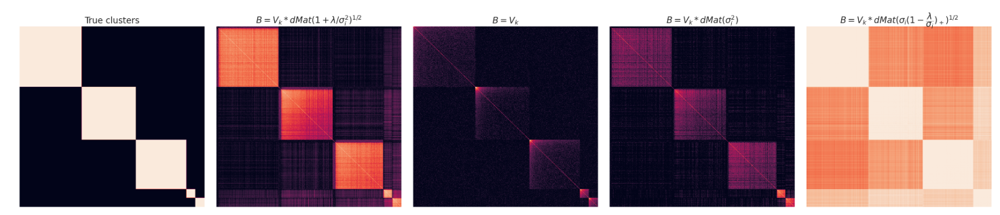
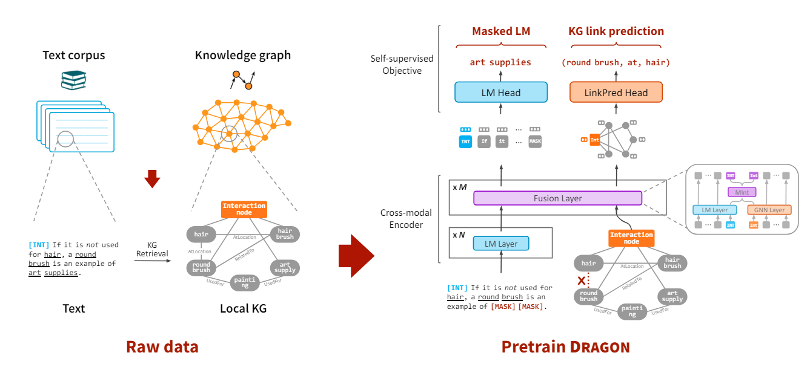
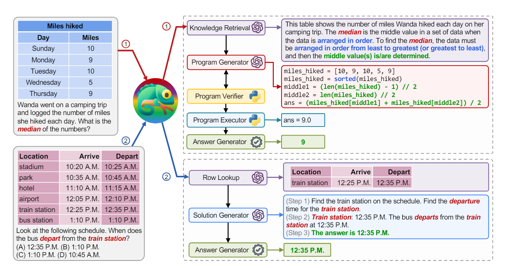
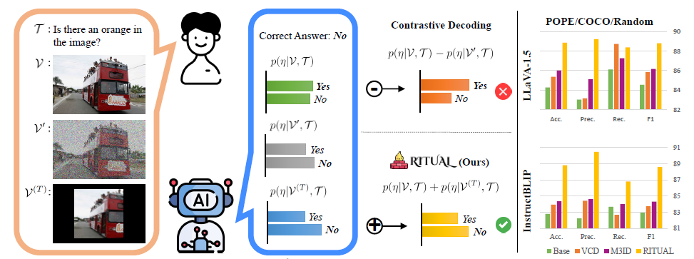
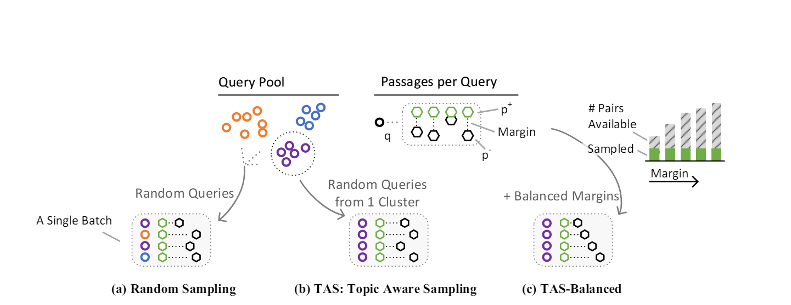

Here is a list of papers I enjoyed reading

### LinkBERT: Pretraining Language Models with Document Links

### Is Cosine-Similarity of Embeddings Really About Similarity?

### [Deep Bidirectional Language-Knowledge Graph Pretraining](https://arxiv.org/abs/2210.09338)

### Chameleon: Plug-and-Play Compositional Reasoning with Large Language Models

### RITUAL: Random Image Transformations as a Universal Anti-hallucination Lever in LVLMs

### [Efficiently Teaching an Effective Dense Retriever with Balanced Topic Aware Sampling](https://arxiv.org/abs/2104.06967)

