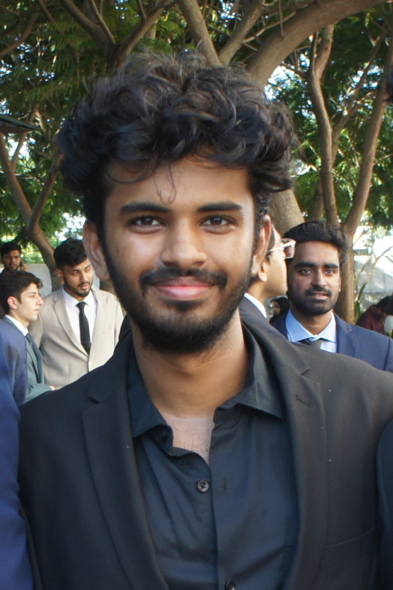

---
# Feel free to add content and custom Front Matter to this file.
# To modify the layout, see https://jekyllrb.com/docs/themes/#overriding-theme-defaults

layout: home
title: Home
order: 1
---

Hello and welcome to my website! 

## About me

<!-- 

 -->

    

 

I am Aarush Sinha, a Computer Science undergraduate student at Vellore Institute of Technology, India. I am interested in Natural Language Processing and its subfields, as well as Multimodal Models. I build models that explore different aspects of natural language by performing tasks such as predictions, information retrieval, and question-answering. In my free time, I enjoy graphic designing as well as music production, both of which can be seen on my [Instagram](https://www.instagram.com/gradientmapwala.flp?igsh=amhjOHNtcjlvbWN1&utm_source=qr).

I am currently working under Prof. Nirav Bhatt at [IIT Madras](https://www.iitm.ac.in/) as a research student. My work lies in information retrieval where I am implementing generative pseudo labelling for various datasets on the BEIR benchmark. I am also a research intern at [AIISC(UofSC)](https://aiisc.ai/) under Prof. Amitava Das, my work in his lab lies in hallucinations occuring in text to video models.

## Recent News

- **January 2025**: 5 questions accepted into [Humanities Last Exam](https://agi.safe.ai/) .

- **January 2025**: [ArxEval: Evaluating Retrieval and Generation in Language Models for Scientific Literature](https://arxiv.org/abs/2501.10483) released on arxiv.

- **November 2024**: [ViBe: A Text-to-Video Benchmark for Evaluating Hallucination in Large Multimodal Models](https://arxiv.org/abs/2411.10867) released on arxiv.

- **October 2024**: Website Launched !

